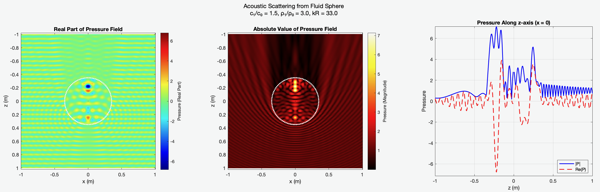

# Anderson Sphere Acoustic Scattering



This repository provides a MATLAB implementation of Anderson's analytical solution for acoustic scattering from a fluid sphere in a fluid medium. The implementation computes the pressure field generated by a fluid sphere when subjected to an incident plane wave or to a point source.

## Theory

The implementation follows [Anderson's 1950 paper](https://pubs.aip.org/asa/jasa/article-abstract/22/4/426/619489/Sound-Scattering-from-a-Fluid-Sphere), and the subsequent extension of [McNew et al.](https://pmc.ncbi.nlm.nih.gov/articles/PMC3132099/pdf/nihms284533.pdf), which solves the acoustic scattering problem using:
- Modal expansion using spherical Bessel and Hankel functions for radial components
- Legendre polynomials for angular dependence
- Assumes an incident plane wave propagating in the negative z-direction or a point source on the `z` axis, at a distance `D` form the sphere.

The solution is valid everywhere except at the center of the sphere, where `r=0`, for any valid combination of fluid properties (sound speed and density).

## Getting Started

The code requires only core MATLAB. It has been tested on MATLAB R2024b.

### Installation

1. Clone this repository:
```bash
git clone https://github.com/astanziola/anderson-sphere-scattering.git
```

2. Add the code directory to your MATLAB path:
```matlab
addpath(genpath("anderson-sphere-scattering"))
```

### Basic Usage

The main function `computeAndersonSphereSolution` calculates the scattered field at any point outside the sphere:

```matlab
P = computeAndersonSphereSolution(p, c0, rho0, c1, rho1, R, omega, order, options)
```

#### Parameters:
- `p`: `3xN` matrix containing `N` position vectors `[x; y; z]` where to evaluate the solution (m). 
        Note that for `N=0` the function returns `NaN`.
- `c0`: Speed of sound in the surrounding medium (m/s)
- `rho0`: Density of the surrounding medium (kg/m³)
- `c1`: Speed of sound in the sphere (m/s)
- `rho1`: Density of the sphere (kg/m³)
- `R`: Radius of the sphere (m)
- `omega`: Angular frequency of the incident wave (rad/s)
- `order`: Maximum order of spherical harmonics to include
- `options.kind`: The kind of source to use, can be one of `{'plane-wave', 'point-source'}`
- `options.D`: The distance of the point source in the `z` axis

## Example Usage

Several example scripts are provided to demonstrate the code:

1. `examples/anderson_sphere_example.m`: An example script showing the scattered field in the x-z plane for a plane wave source
2. `examples/anderson_sphere_convergence.m`: An example script demonstrating how to analyze the convergence of the solution and provides convergence plots for different directions
3. `examples/example_point_source.m`: An example script showing the scattered field in the x-z plane for a point source

## License

This project is licensed under the LGPL-3.0 license - see the LICENSE file for details.

## References

1. Anderson V. C. (1950). "Sound scattering from a fluid sphere." The Journal of the Acoustical Society of America, July 1950; 22 (4): 426–431
2. McNew  J., Lavarello R., O’Brien W. (2007) "Sound scattering from two concentric fluid spheres." The Journal of the Acoustical Society of America, 2007 Nov; 122(5):2968